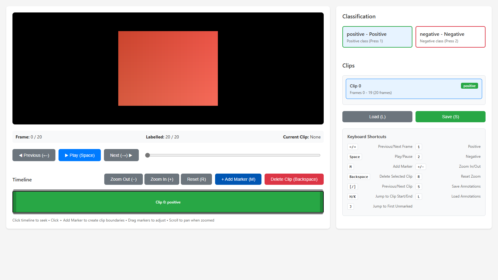
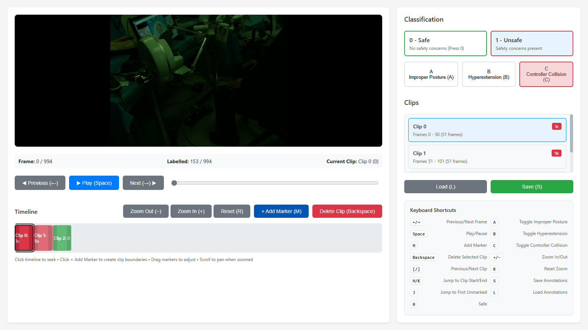

# frame-annotator

A lightweight, configurable web tool for annotating video frames with classification labels. Built for research workflows — define your own annotation taxonomy via YAML, launch a local web interface, and export structured annotations in JSON and CSV.

## Features

- **Config-driven classes** — Define any number of classification labels with colors, keyboard shortcuts, and optional subcategories via YAML or JSON
- **Clip-based annotation** — Group consecutive frames into clips and assign labels, rather than annotating frame-by-frame
- **Interactive timeline** — Visual timeline with zoom, pan, drag-to-adjust clip boundaries, and color-coded segments
- **Keyboard shortcuts** — Navigate frames, assign classes, and manage clips without touching the mouse
- **Dual export** — Annotations saved as both JSON (clip-level) and CSV (frame-level), with timestamped backups
- **Zero dependencies beyond Flask** — Runs locally with pip install, no database or frontend build step required

## Quick Start

Install from source:

    git clone https://github.com/omariosc/frame-annotator.git
    cd frame-annotator
    pip install -e .

Then run:

    frame-annotator path/to/your/frames/

Open http://127.0.0.1:5001 in your browser.

### Try with sample data

    frame-annotator sample_data/frames/

### Use a custom config

    frame-annotator path/to/frames/ --config examples/surgical_safety.yaml

## Configuration

Create a YAML file to define your annotation classes:

    project:
      name: "My Annotation Task"
      description: "Optional description shown in the UI"

    images:
      pattern: "*.png"

    classes:
      - id: "0"
        name: "Safe"
        color: "#28a745"
        shortcut: "0"
        description: "No safety concerns"

      - id: "1"
        name: "Unsafe"
        color: "#dc3545"
        description: "Safety concerns present"
        subcategories:
          - id: "a"
            name: "Improper Posture"
            shortcut: "a"
          - id: "b"
            name: "Hyperextension"
            shortcut: "b"

### Config reference

| Field | Required | Description |
|-------|----------|-------------|
| project.name | No | Display name (default: Frame Annotator) |
| project.description | No | Shown in the UI header |
| images.pattern | No | Glob pattern for frames (default: *.png) |
| classes[].id | Yes | Unique identifier for the class |
| classes[].name | Yes | Display name |
| classes[].color | Yes | Hex color code (e.g. #28a745) |
| classes[].shortcut | No | Single-key keyboard shortcut |
| classes[].description | No | Tooltip text |
| classes[].subcategories | No | List of subcategory objects |
| subcategories[].id | Yes | Single character identifier |
| subcategories[].name | Yes | Display name |
| subcategories[].shortcut | No | Single-key keyboard shortcut |

See the examples/ directory for complete configs: surgical_safety.yaml (binary with subcategories), action_recognition.yaml (multi-class), and defect_detection.yaml (simple binary).

## CLI Options

    Usage: frame-annotator <image_dir> [options]

    Positional arguments:
      image_dir              Path to directory containing image frames

    Options:
      --config, -c FILE      YAML/JSON config file (default: built-in binary classifier)
      --output, -o DIR       Output directory for annotations (default: <image_dir>/annotations/)
      --port, -p PORT        Port number (default: 5001)
      --host HOST            Host to bind (default: 127.0.0.1)

## Keyboard Shortcuts

| Key | Action |
|-----|--------|
| Left / Right | Previous / Next frame |
| Space | Play / Pause |
| M | Add marker at current frame |
| Backspace | Delete selected clip |
| [ / ] | Previous / Next clip |
| H / K | Jump to clip start / end |
| J | Jump to first unmarked frame |
| + / - | Zoom in / out on timeline |
| R | Reset zoom |
| S | Save annotations |
| L | Load annotations |
| 1, 2, ... | Assign class (from config shortcuts) |

## Output Format

Annotations are saved to <image_dir>/annotations/ (or the --output directory):

**annotations.json** — Clip-level annotations:

    {
      "clips": [
        {"start": 0, "end": 50, "class": "0"},
        {"start": 51, "end": 100, "class": "1b"}
      ]
    }

**annotations.csv** — Frame-level expansion:

    frame,filename,clip_id,class
    0,frame_0000.png,0,0
    1,frame_0001.png,0,0
    ...
    51,frame_0051.png,1,1b

Timestamped backups (e.g. annotations_20250115_143022.json) are created on every save.

## Citation

If you use frame-annotator in your research, please cite:

    @software{choudhry2025frameannotator,
      author       = {Choudhry, Omar},
      title        = {frame-annotator: A Configurable Web Tool for Video Frame Annotation},
      year         = {2025},
      url          = {https://github.com/omariosc/frame-annotator},
      version      = {0.1.0}
    }

## License

MIT License. See [LICENSE](LICENSE) for details.
