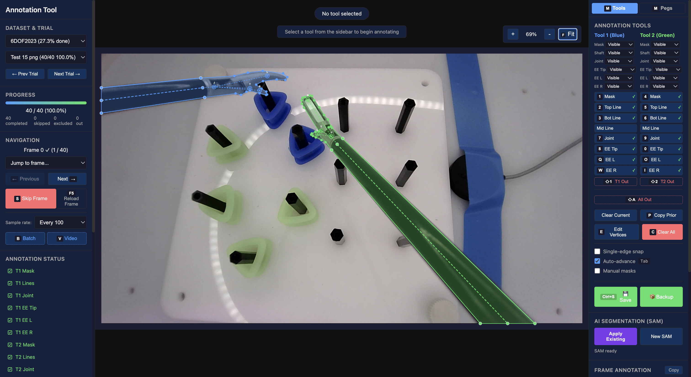
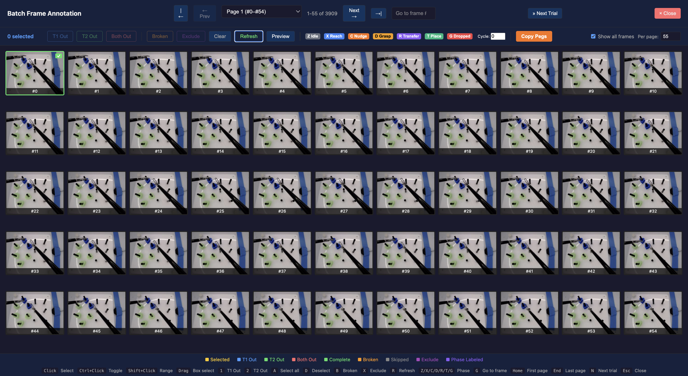
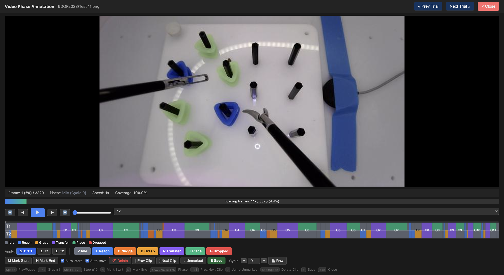

# Surgical Video Annotation Tools

Two complementary, open-source web tools for annotating surgical video, in one repo. Both run locally in the browser, store results as plain files, and need no database or frontend build step.

> **Why this exists.** The safety of a surgical-AI system is bounded by the quality of the data it learns from — mislabelled, ambiguous, or inconsistently annotated video propagates silently into every downstream model, where it is hard to detect and dangerous to trust. These tools treat annotation as a first-class, reproducible, openly documented process, so that the data underpinning surgical AI can be trusted and audited. `surgical-annotator` underpins our MICCAI 2026 **SafeSurg** abstract, *An Open-Source Annotation Framework for Trustworthy Multi-Task Surgical Video Labelling*.

| Tool | What it labels | Port | Best for |
|------|----------------|------|----------|
| **frame-annotator** | Clip-level **classification** on a timeline (config-driven taxonomy) | 5001 | Fast phase / event / safety labelling — e.g. robotic surgical-safety labelling |
| **surgical-annotator** | **Multi-task geometry**: per-instrument segmentation masks, shaft lines, and keypoints, plus a hierarchical phase / event timeline | 5000 | Detailed training data for detection, pose, and phase models |

`surgical-annotator` is built on the same Flask + timeline foundation as `frame-annotator`; this repo ships both so you can pick the right granularity for the task.

---

## Gallery

### surgical-annotator — multi-task geometry + phases

**Figure 1 — The annotation interface.** A single frame labelled with two-instrument segmentation masks (Tool 1 blue, Tool 2 green), top and bottom shaft lines with an auto-computed midline, and four end-effector keypoints per tool. The right panel holds the per-component visible / occluded / out-of-scene controls, the SAM assistance panel, and a live JSON view; the left panel holds trial selection, the progress bar, and the status checklist.

**Figure 2 — Batch annotation mode.** A paginated thumbnail grid for rapid mass-labelling: frames are multi-selected (click, shift-range, or select-all) and flagged in bulk as tool-absent/negative, broken, or excluded, with colour-coded status borders, enabling fast triage of hundreds of frames and isolation of corrupt frames before they enter training or evaluation.

**Figure 3 — Video mode with phase annotations.** A timeline view for temporal labelling, where frame ranges are assigned hierarchical phase and event labels (e.g., reach, grasp, transfer) along a scrubable video timeline, with copy/apply/restore and batched saving, producing the temporal labels that complement the per-frame geometry.

### frame-annotator — clip classification

**Figure 4 — The predecessor tool (frame-annotator).** The original config-driven, clip-based classification tool used for robotic surgical-safety labelling, on which the present framework is built; annotators assign taxonomy labels to frame ranges along a timeline and export clip- and frame-level annotations (config: `examples/surgical_safety.yaml`).

The general clip-classification interface — define any taxonomy in YAML (see `examples/`).

---

## Install (one install, both tools)

    git clone https://github.com/omariosc/frame-annotator.git
    cd frame-annotator
    pip install -e .

This installs the **core, offline** stack for *both* tools — no GPU or PyTorch required. Core dependencies: `flask`, `pyyaml`, `numpy`, `Pillow`.

Optional AI-assist extras for `surgical-annotator` (SAM-assisted masking, depth / embedding precompute):

    pip install -e ".[ai]"

> The `[ai]` extra pulls in `torch`, `torchvision`, and `opencv-python`. The SAM2 and Depth-Anything-V2 model packages/weights are installed separately — see [`surgical_annotator/README.md`](surgical_annotator/README.md).

---

## Run either tool

### frame-annotator (clip classification → http://127.0.0.1:5001)

    frame-annotator path/to/frames/ --config examples/surgical_safety.yaml
    # equivalently:
    python -m frame_annotator path/to/frames/ --config examples/surgical_safety.yaml

- Define your own taxonomy in YAML — see `examples/` (`surgical_safety.yaml`, `action_recognition.yaml`, `defect_detection.yaml`) and [`frame_annotator/README.md`](frame_annotator/README.md).
- Try it instantly with the bundled sample frames:

      frame-annotator sample_data/frames/

### surgical-annotator (multi-task geometry + phases → http://localhost:5000)

    surgical-annotator --data-dir /path/to/data
    # equivalently:
    python -m surgical_annotator --data-dir /path/to/data

- `--data-dir` should contain any of `6DOF2023/`, `7DOF2024/`, `BAPES2024/`, `outputs/` (missing datasets are skipped; defaults to `./data`).
- Annotate per-instrument masks, shaft lines, and keypoints, plus phase/event timelines; exports to YOLO and per-frame JSON.
- AI-assisted masking (SAM) and precompute steps require the `[ai]` extra and model weights.
- Full docs: [`surgical_annotator/README.md`](surgical_annotator/README.md).

---

## Which tool do I want?

- **Classifying** frames/clips into categories (phases, safe/unsafe, actions)? → **frame-annotator**.
- Drawing **masks / shaft lines / keypoints** per instrument, or building rich multi-task labels? → **surgical-annotator**.

## Repository layout

    frame_annotator/        # clip-classification tool (:5001)        — docs: frame_annotator/README.md
    surgical_annotator/     # multi-task geometry/phase tool (:5000)  — docs: surgical_annotator/README.md
    examples/               # YAML taxonomies for frame-annotator
    sample_data/            # sample frames for frame-annotator
    docs/screenshots/       # README images
    pyproject.toml          # installs both tools + the `surgical-annotator` / `frame-annotator` commands

## Citation

If you use these tools in your research, please cite:

    @software{choudhry2025frameannotator,
      author = {Choudhry, Omar},
      title  = {Surgical Video Annotation Tools (frame-annotator and surgical-annotator)},
      year   = {2025},
      url    = {https://github.com/omariosc/frame-annotator}
    }

## License

MIT License. See [LICENSE](LICENSE) for details.
